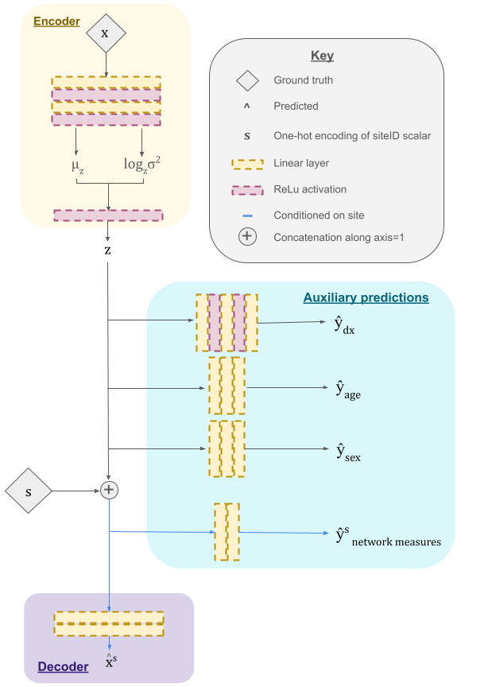
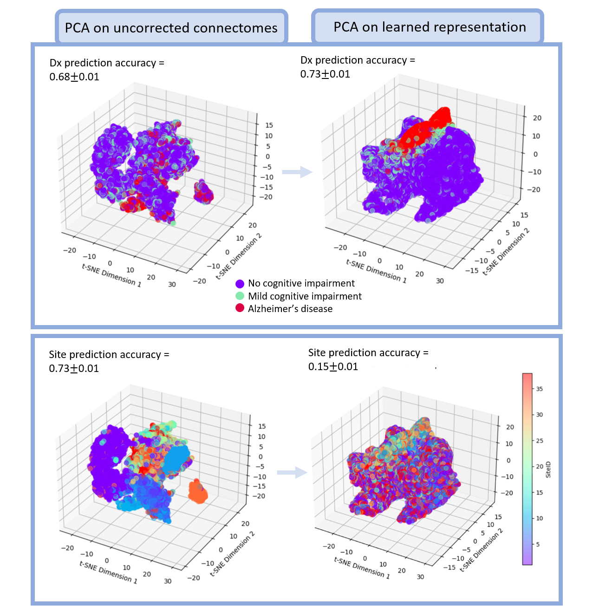

# BrainNetworkHarmonization
This project contains the architecture, training, and testing frameworks for our cVAE for harmonizing connectomes. Outputs include a set of site-invariant features and harmonized network properties (set of scalars). 

This code accompanies the publication "Harmonizing 10,000 connectomes: Site-invariant representation learning for multi-site analysis of network connectivity and cognitive impairment". 

* The data set up in ExampleData is how the dataloader_train and dataloader_test expect the data to be organized inside of DATA/TRAIN
* If running yourself, make sure to change the paths to your desired input/output locations.

The architecture follows this schematic:

Here is an example figure showing the clustering based on site and diagnosis in uncorrected (left) and corrected (right) connectome features. 

### GPU specifications
We trained this model with Quadro RTX 5000 and 16GB RAM with PyTorch version 0.4.1.
